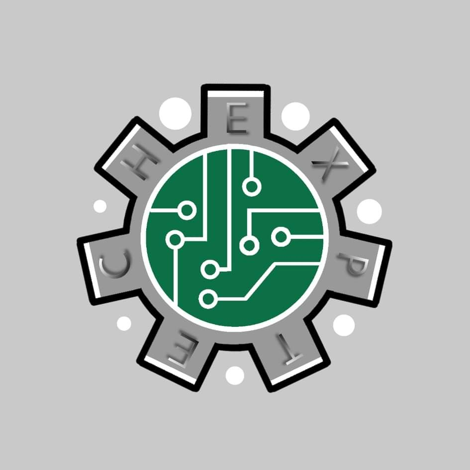

# ExpTech 探索科技 GitHub

編程、設計、創意、實用
 
努力成為真正的高手
 

  
  <h3 align="center">ExpTech</h3>
  

    ! 用科技創造無限可能 !
     
    ·
    <a href="https://github.com/ExpTech-tw/Example/issues">錯誤回報</a>
    ·
  

## 項目概要
* 這是一個由 ExpTech.tw 開發的機器人
* [邀請鏈接]( https://reurl.cc/Xloo6D)
* 官方 [Discord](https://discord.gg/rkPu3msUf3)

## 索引
- [開始](#開始)
  - [註冊服務](#註冊服務)
- [權限](#權限)
- [指令](#指令)
  - [指令列表](#指令列表)

## 文檔
### 開始
#### 註冊服務
* 使用 /et register 申請服務

### 權限
owner

4

最高權限，所有者，具有控制物理服務器的能力嗎。例子：服務器擁有者

admin

3

管理員，擁有控制MCDR 與Minecraft 服務器的能力。例子：Minecraft 中的OP

helper

2

助手，可以協助管理員進行服務器管理。例子：值得信賴的成員

user

1

普通玩家

guest

最低權限，如訪客或者熊孩子

### 指令
#### 指令列表
- [/et register](#/et register)

#### /et register 
- 權限: 4
- 默認: null
- 選項: null

## 貢獻者
* whes1015 - 編輯模板
